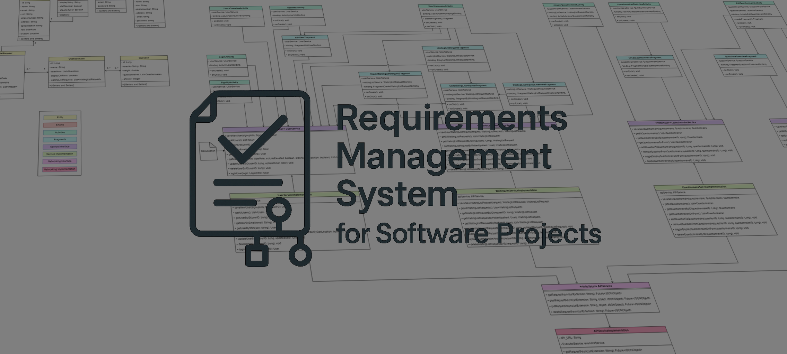

## HBV403G Vefforritun 2 - Einstaklingsverkefni
# Kröfuumsjónarkerfi fyrir Hugbúnaðarverkefni
#### Requirements Management System for Software Projects

## Um Hugbúnaðinn
Umsjónarkerfi sem heldur utan um kröfur fyrir hugbúnaðarverkefni. 

Fyrir nánari upplýsingar:

* Um eiginleika forritsins → [Eiginleikar](#eiginleikar).
* Um bakendann → [Bakendi](backend/README.md).
* Um framendann → [Framendi](frontend/README.md).

## Hýsing
Umsjónarkerfið er í ókeypis hýsingu hjá Render, og hægt er að nálgast það [hér](https://hbv403g-vef2-ev-frontend.onrender.com).

## Eiginleikar
Í núverandi mynd uppfyllir hugbúnaðurinn alla þá eiginleika sem settir voru fram í [Verkefnisáætluninni](projectPlan.md). 

Notendur geta:

* Búið til aðgang og þá búið sér til sín eigin verkefni
* Í hverju verkefni er hægt að:
  * Hlaða upp einni mynd af UML klasariti eða öðru tengdu verkefninu 
  * Skilgreina og halda utan um:
    * **Leikara** (*e. Actors*), t.d. nafn og lýsingu
    * **Viðskiptareglur** (*e. Business Rules*), t.d. lýsing reglu, tegund o.þ.h. 
    * **Notkunardæmi** (*e. Use Cases*), sem geta innihaldið ýmsar upplýsingar á borð við:
      * **Flæði** (*e. FLow*), þ.e. venjulegt-, önnur- og undanteklingarflæði (*e. Normal, Alternate & Exception Flows*), sem hver fyrir sig hafa skref og mögulegar tilvísanir.
      * **Skilyrði** (*e. Conditions*), þ.e. bæði for- og eftirskilyrði (*e. Pre- & Postconditions)
      * **Viðskiptareglur og Leikara** skráð undir verkefninu.
  * Flest fær skýrt og læsilegt auðkenni svo hægt er að benda á annars staðar í verkefninu með auðveldum máta
    * Þá er hægt að vitna í hluta, þar sem tengingar verða skráðar, svo ekki þarf að skilgreina hluti tvisvar
  * Skoða breytingar og afturkalla þær ef þarf

Fleiri eiginleikar kunna að koma síðar.

## Verkefnalýsing
Nánari lýsing á verkefninu → [Verkefnisáætlun](projectPlan.md).

### Skýrsla
Skýrsla verkefnisins: [Skýrsla](report/ProjectReport.pdf).

## Hönnunarskjöl
Hönnun eininda í bakenda → [Hönnunarskjöl](backend/designDocs/design.md).

## Leyfi
Þetta verkefni er gefið út undir MIT leyfinu - sjá [LICENSE](LICENSE), og [SPDX](https://spdx.org/licenses/MIT.html).

